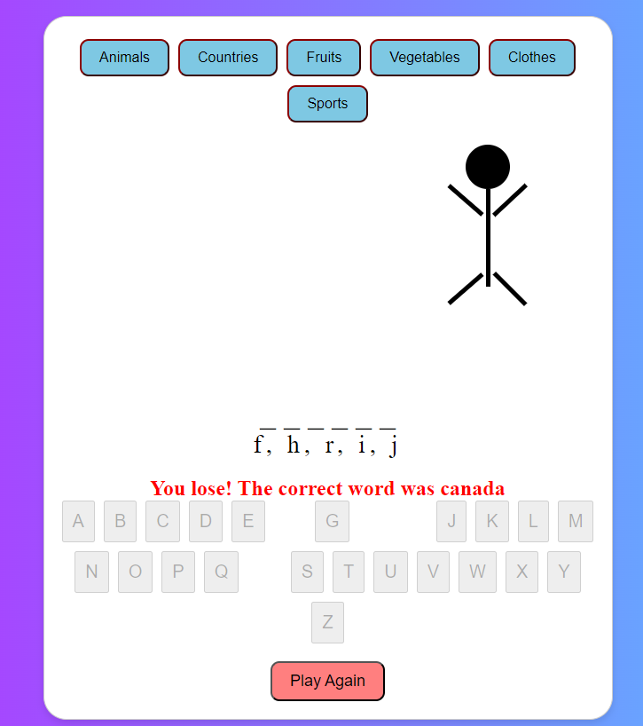
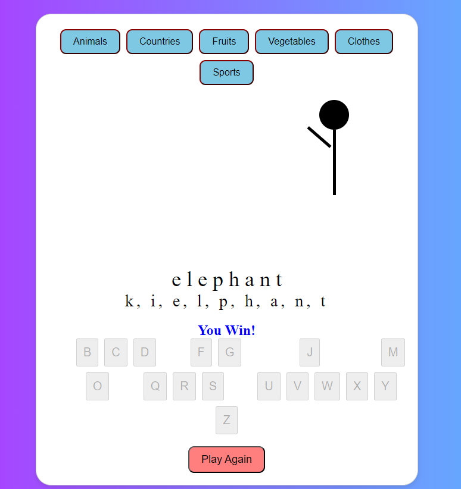

# Hangman Game

Date: 10/7/2024

[hangman](https://twix0217.github.io/hang-man/)

## **Description**
**Hangman game is game which is developed using HTML, CSS, and JavaScript. It includes several elements such as categories buttons, keyboard buttons, hangman drawing, and the play again button. This hangman game project is implemented to enhance the skills of games development**

## **How to play**

1. Open `hangman.html` in yor web browser.
2. Select one of the avilable word categories.
3. Try to guess the word by selecting letters from the keyboard.
4. If you exceed 5 guesses you will lose, otherwise you can continue playing until you complete the chosen word.
5. If the game ended, you can press on the play again button to play another game.

## Technologies used
* HTML
    * hangman.html 
* CSS
    * hangman.css
* javaScript
    * hangman.js

## Screenshots

## Future Updates
1. Add an execution platform in the game.
2. Add sounds and execution animations.

## Credits
* MDN Website
* w3schools website
* chatGPT
* Youtube
* Markdown cheat sheet
  
